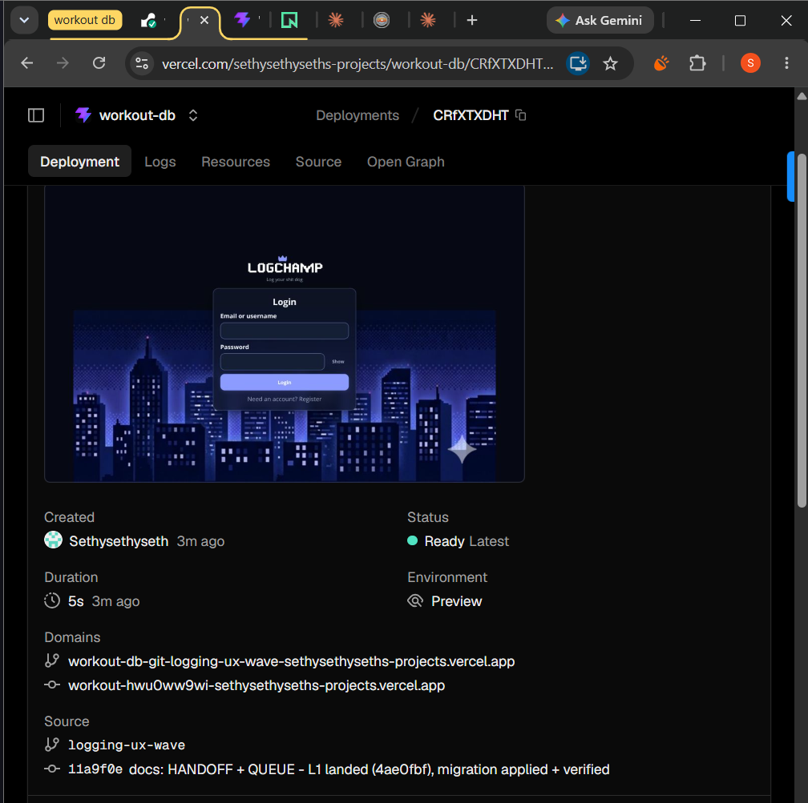
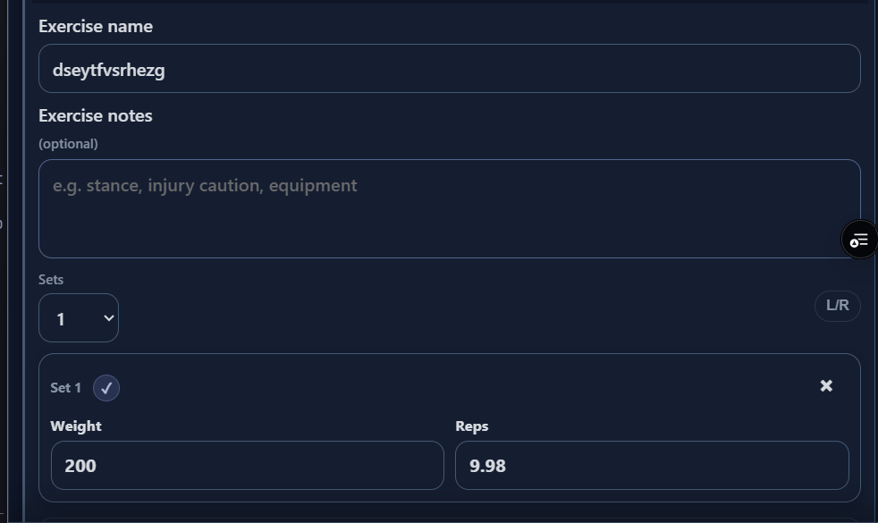
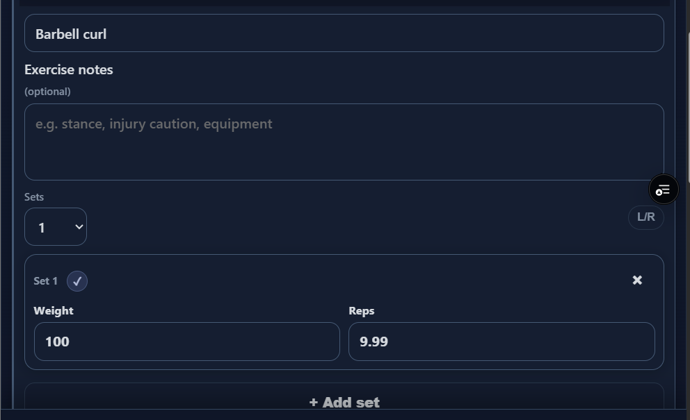
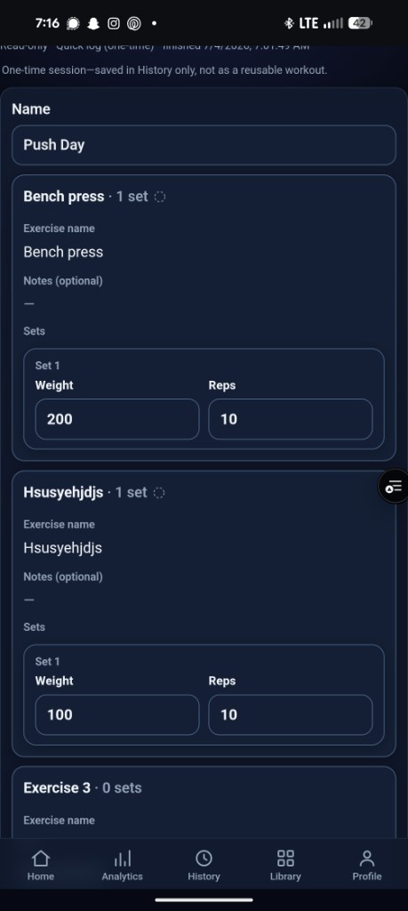

# L2 decimal-reps smoke evidence (July 4, 2026)

On-device screenshots from Seth's visual smoke of the `logging-ux-wave`
staging/preview deploy. Drop-in for Claude Code review - open the images
directly.

## Deploy context

- Branch: `logging-ux-wave`
- Commit: `11a9f0e` ("docs: HANDOFF + QUEUE - L1 landed (4ae0fbf), migration applied + verified")
- Environment: Vercel preview (not prod)

## Bug: reps display as decimals (9.98 / 9.99)

User entered whole-number reps; the session-edit form shows fractional values.

### Shot 1 - arbitrary exercise name

- Exercise: `dseytfvsrhezg`
- Weight: `200`
- Reps shown: **`9.98`** (expected integer)

### Shot 2 - barbell curl

- Exercise: `Barbell curl`
- Weight: `100`
- Reps shown: **`9.99`** (expected integer)

## Read-only session detail (contrast)

After finishing the quick log, History shows the saved session. Reps display
as whole numbers here (`10`), not the fractional values seen in the edit form.

- Route: read-only session detail (Quick log one-time)
- Workout: **Push Day**, finished 7/4/2026 ~7:01 AM
- Exercises:
  - Bench press — 1 set, weight `200`, reps **`10`**
  - Hsusyehjdjs — 1 set, weight `100`, reps **`10`**
  - Exercise 3 — empty placeholder, 0 sets

## Notes for triage

- Edit-form shots (above) show fractional reps; read-only detail shows integers — bug may be edit-form display/state only, not persisted data.
- Edit-form shots use the in-session exercise edit form (Sets dropdown + L/R toggle visible).
- Pattern suggests a floating-point or rounding/display bug on read-back in edit mode, not user input of decimals.
- Related prior incident: decimal-reps loop noted in `WORKOUTDB_MASTER_PROMPT_17.md` (staging branch mismatch); this may be a separate UI bug on L2.
