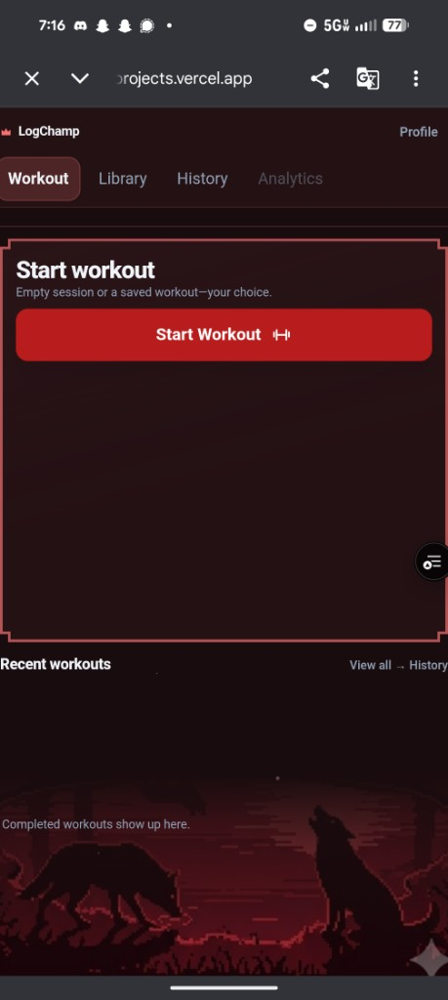
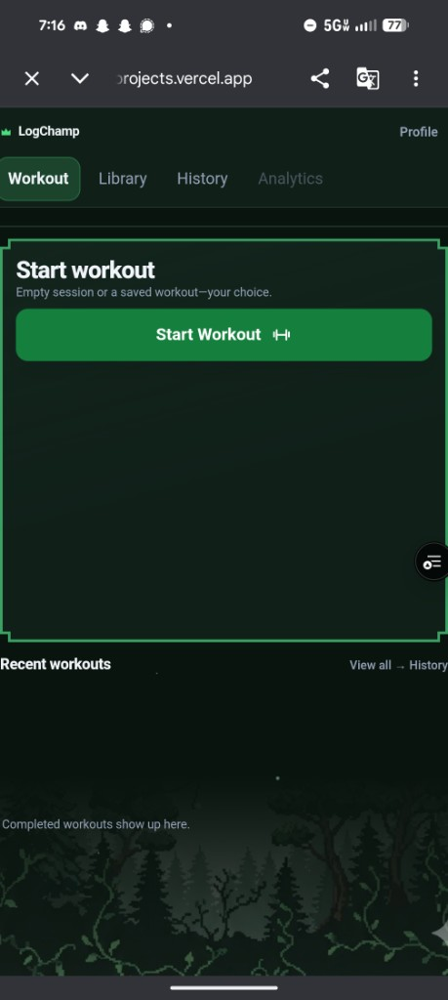
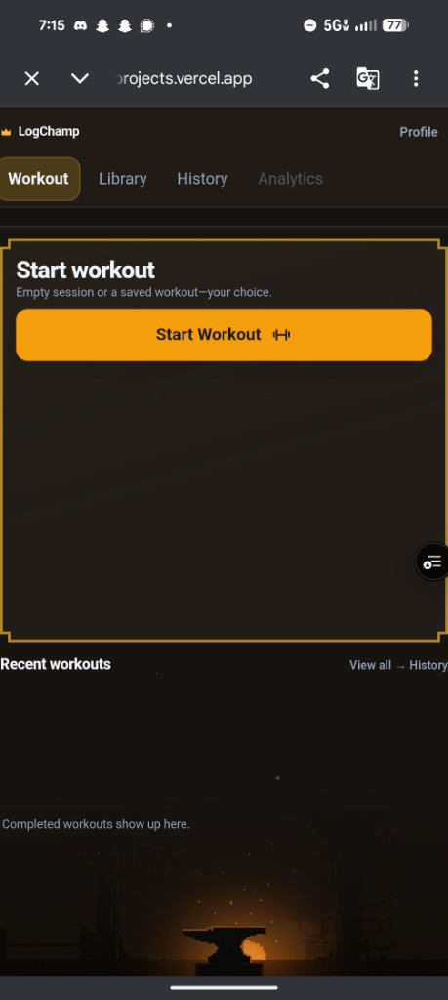
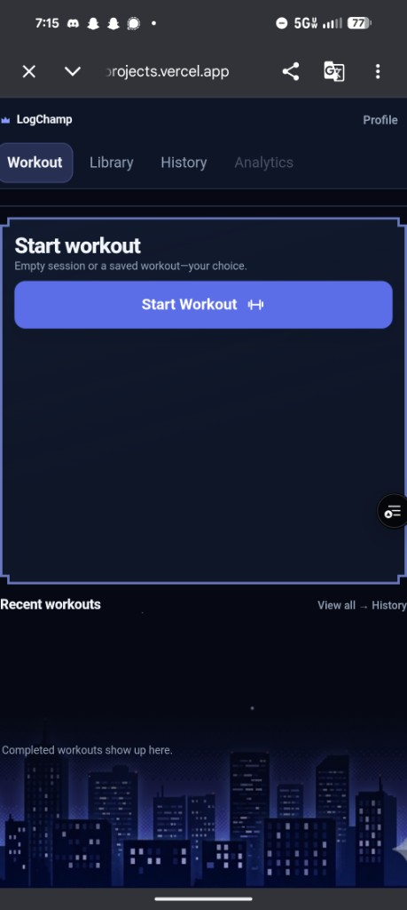
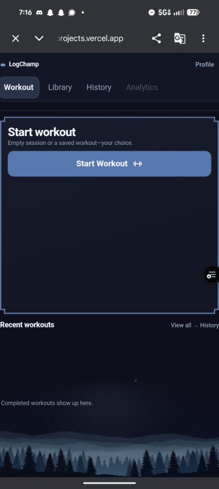

# Scene Smoke-Test Critique

On-device smoke shots of the palette scenes (`body::before` raster bands) for
visual review. Drop new shots in `docs/smoke-tests/images/`, add an entry below,
and have Claude Code (or whoever) look at the image and fill in the critique.

## How to use (for Claude Code)

1. Open each image referenced below and look at it directly.
2. Judge against the checklist, not vibes. Note anything that reads as a bug vs.
   a taste call.
3. Write findings under each shot: what works, what's off, and a concrete fix
   (token/value/crop change) if there is one. Keep display-layer only - no
   infra/env/route renames (see CLAUDE.md rename boundary).

## Checklist per scene

- Band sits at the bottom of the viewport, correct height (matches champ band).
- No gray frame, rounded corners, or leftover mockup UI ghosting behind cards.
- Scene is dark-mode-only; light mode should be glow-only (no raster).
- Readability: text/cards still legible over the band; glow not overpowering.
- Seams/tiling: no hard repeat edge or visible cutoff mid-scene.
- Dead-zone between "Start workout" and "Recent workouts" - acceptable or empty?

---

## Shots

> Set below reshot 2026-07-01, post dead-zone glow-widen (widened per-palette
> Home ambient glow reach + boosted star-glint opacity). Supersedes the
> 2026-06-30 fade-fix round. Critiques below are pending re-review against
> these fresh shots.

### Crimson - dark - Home (Workout tab)

- Palette: `crimson` | Theme: `dark` | Route: Home / Workout tab
- Source: on-device, 2026-07-01 (post dead-zone glow-widen)
- Critique: pending re-review.

### Forest - dark - Home (Workout tab)

- Palette: `forest` | Theme: `dark` | Route: Home / Workout tab
- Source: on-device, 2026-07-01 (post dead-zone glow-widen)
- Critique: pending re-review.

### Iron - dark - Home (Workout tab)

- Palette: `iron` | Theme: `dark` | Route: Home / Workout tab
- Source: on-device, 2026-07-01 (post dead-zone glow-widen)
- Critique: pending re-review.

### Champ - dark - Home (Workout tab)

- Palette: `champ` | Theme: `dark` | Route: Home / Workout tab
- Source: on-device, 2026-07-01 (post dead-zone glow-widen)
- Critique: pending re-review.

### Chill - dark - Home (Workout tab)

- Palette: `chill` | Theme: `dark` | Route: Home / Workout tab
- Source: on-device, 2026-07-01 (post dead-zone glow-widen)
- Critique: pending re-review.

---

## Matrix status

All 5 palettes (champ, iron, chill, forest, crimson) confirmed dark/Home with
the shared fade-mask band, no hard seams, no regressions. Light mode and
non-Home routes not covered by this round (all use --scene-image / glow-only
paths that predate this fix and weren't touched by it). Outstanding, not
palette-specific: the empty dead-zone between Start Workout and Recent
Workouts, visible across all 5 shots - next up.
